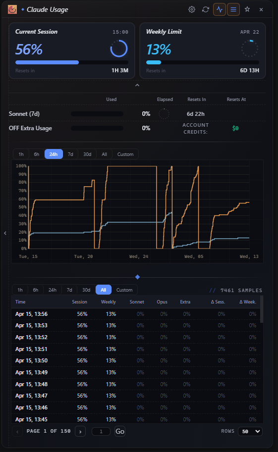
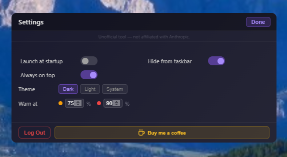

# Claude Widget (GTRows fork)

Desktop widget for Claude.ai usage monitoring — a personal fork of the original [claude-usage-widget](https://github.com/SlavomirDurej/claude-usage-widget) by Slavomir Durej, with additional features and UI changes.

Runs on **Windows, macOS, and Linux**.



---

## Features

🎯 **Real-time Usage Tracking** — Monitor both session and weekly usage limits
📊 **Visual Progress Bars** — Clean, gradient progress indicators with configurable warning thresholds
⏱️ **Countdown Timers** — Circular timers showing time elapsed in the current session window
🔄 **Auto-refresh** — Updates every 5 minutes automatically, with animated refresh indicator
📈 **Usage History Graph** — Toggleable 7-day chart showing session and weekly trends over time
🌍 **Currency Support** — Extra usage displays your account's billing currency (€, £, $)
🎨 **Modern UI** — Sleek, draggable widget with dark and light themes
🔒 **Secure** — Encrypted credential storage
📍 **Always on Top** — User-controlled, stays visible across all workspaces
💾 **System Tray** — Minimizes to tray for easy access
⚙️ **Settings Panel** — Persistent preferences for startup, theme, tray, thresholds, and date/time formats
🔔 **Usage Alerts** — Desktop notifications when usage crosses configurable warn/danger thresholds
🔔 **Update Notifications** — Automatic check for new releases on startup
🕐 **Configurable Date & Time Formats** — 12h/24h time, and flexible weekly reset date display
📐 **Compact Mode** — Minimal view for when you just need a quick glance

---

## What's New in v1.11.0-gtrows.1

### Tray mascot, reworked

- Animate mascot renders on a 64 px canvas so Windows tray downscaling
  stays crisp at 16–24 px.
- Larger motion deltas: breathing pulse, head tilt, full-width eye
  darts, red/amber flash with scale pulse near the limit.
- New setting `Mascot animation length` (1–60 s, default 2 s) scales
  a full play to the requested duration.
- New setting `Pause between plays` (0–600 s, default 10 s) holds the
  big-number tray icon between animations.
- Launch shows the big number first; the mascot only plays after the
  first pause elapses.

### CLI

- `claude-usage history --since N --format csv|json [--output FILE]`
  reads the widget's stored history without going through Electron.
- `claude-usage doctor` diagnoses credentials, widget store presence,
  and live API reachability.
- `claude-usage prompt --segments 5h,7d,opus,sonnet,extra` selects
  which usage segments render inline in shell prompts.
- `claude-usage prompt --cache N` caches the latest response for N
  seconds so prompts redraw without hitting the API on every keystroke.

### Settings / Data

- Export history now offers a date-range selector (All / 24h / 7d /
  30d / 90d) before writing CSV or JSON.

> For full release history, see [CHANGELOG.md](./CHANGELOG.md) and the
> [Releases](../../releases) page.

---

## Screenshots

### Settings Panel




### Settings Options

- ⚙️ **Launch at startup** — Auto-start with Windows or macOS login
- 📌 **Hide from taskbar** — Tray-only mode
- 🎨 **Theme selector** — Dark / Light / System
- ⚠️ **Warning thresholds** — Configurable amber and red levels for usage bars
- 🔔 **Usage alerts** — Desktop notifications at warn/danger thresholds
- 🕐 **Time format** — 12h or 24h
- 📅 **Date format** — Controls how the weekly reset date is displayed
- 📐 **Compact mode** — Minimal two-bar view

---

## Installation

### Download Pre-built Release

**Windows:**
1. Download the latest `Claude-Usage-Widget-{version}-win-Setup.exe` (installer) or `Claude-Usage-Widget-{version}-win-portable.exe` (no install needed) from [Releases](../../releases)
2. Run the installer or portable exe
3. Launch "Claude Usage Widget" from the Start Menu (installer) or directly (portable)

**macOS:**
1. Download the latest `Claude-Usage-Widget-{version}-macOS-arm64.dmg` (Apple Silicon) or `Claude-Usage-Widget-{version}-macOS-x64.dmg` (Intel) from [Releases](../../releases)
2. Open the DMG and drag the app to your Applications folder
3. Launch "Claude Usage Widget" from Applications

> **⚠️ macOS Security Notice:** Because this app is not yet notarized with Apple, macOS Gatekeeper may show a "damaged or can't be opened" warning. To fix this, run the following command in Terminal after installing:
> ```
> xattr -cr /Applications/Claude\ Usage\ Widget.app
> ```
> Then try launching the app again.

**Linux:**
1. Download the latest `Claude-Usage-Widget-{version}-linux-x86_64.AppImage` (Intel/AMD) or `Claude-Usage-Widget-{version}-linux-arm64.AppImage` (ARM) from [Releases](../../releases)
2. Make it executable: `chmod +x Claude-Usage-Widget-*.AppImage`
3. Run it: `./Claude-Usage-Widget-*.AppImage`

> **Note:** AppImage runs without installation on most Linux distributions. On Ubuntu 22.04+, you may need to install a dependency first:
> ```bash
> sudo apt install libfuse2
> ```

---

### CLI via npm (cross-platform)

The `claude-usage` CLI ships as a separate npm package and works on Windows, macOS, and Linux without installing the Electron desktop app. It reuses the same credential store when the desktop app is installed, and falls back to a headless login flow when it is not.

```bash
npm install -g claude-usage-widget
```

Prereleases are published under the `next` dist-tag:

```bash
npm install -g claude-usage-widget@next
```

Then from any terminal:

```bash
claude-usage login --key <sessionKey> --org <orgId>   # first-time auth
claude-usage status                                   # one-shot usage snapshot
claude-usage history --since 7 --format csv
claude-usage doctor                                   # diagnose credentials and API reachability
claude-usage prompt --segments 5h,7d,opus,sonnet,extra --cache 30
```

Credentials can also come from `CLAUDE_SESSION_KEY` + `CLAUDE_ORGANIZATION_ID` environment variables. Run `claude-usage help` for the full command list. Requires Node.js 18+.

---

### Build from Source

**Prerequisites:**
- Node.js 18+ ([Download](https://nodejs.org))
- npm (comes with Node.js)

```bash
git clone https://github.com/GTRows/claude-usage-widget.git
cd claude-usage-widget
npm install
npm start
```


---

## Usage

### First Launch

1. Launch the widget
2. Click "Login to Claude" when prompted
3. A browser window will open — log in to your Claude.ai account
4. The widget will automatically capture your session
5. Usage data will start displaying immediately

### Widget Controls

- **Drag** — Click and drag the title bar to move the widget
- **Refresh** — Click the refresh icon to update data immediately
- **Graph** — Click the graph icon to toggle usage history
- **Minimize** — Click the minus icon to hide to system tray / dock
- **Close** — Click the X to minimize to tray (doesn't exit)

### System Tray

Right-click the tray icon for: Show/Hide, Refresh, Re-login, Settings, Exit.

---

## Understanding the Display

### Current Session & Weekly Limit

| Column | Description |
|--------|-------------|
| Session Used | Progress bar showing usage from 0–100% |
| Elapsed | Circular timer showing how far through the window you are |
| Resets In | Countdown until the window resets |
| Resets At | Actual local clock time / date when the window resets |

**Color Coding:**
- 🟣 Purple: Normal usage (below warning threshold, default 75%)
- 🟠 Orange: High usage (above warning threshold)
- 🔴 Red: Critical usage (above danger threshold, default 90%)

---

## Privacy & Security

- Credentials stored **locally only** using encrypted storage
- No data sent to any third-party servers
- Only communicates with the official Claude.ai API
- Logout clears all session data, cookies, and Electron session storage

---

## Troubleshooting

**"Login Required" keeps appearing** — Session may have expired. Click "Login to Claude" to re-authenticate.

**Widget not updating** — Check internet connection, click refresh manually, or try re-logging in from the tray menu.

**Build errors** — Clean reinstall resolves most issues:
```bash
rm -rf node_modules package-lock.json
npm install
```

If issues persist, open a [Support discussion](../../discussions/categories/support) with your OS, Node.js version, and full error output.

---

## Roadmap

- [x] macOS support
- [x] Linux support
- [x] Settings panel
- [x] Remember window position
- [x] Custom warning thresholds
- [x] Configurable date & time formats
- [x] Update notifications
- [x] Usage alerts at thresholds
- [x] Compact mode
- [x] Usage history graph
- [x] Currency support
- [x] CLI companion (`claude-usage`) with history, doctor, prompt
- [x] Animated tray mascot with configurable timing
- [x] Export history with date-range filter
- [x] Cross-platform CLI install via npm (`npm install -g claude-usage-widget`)
- [ ] Fresh GTRows visual assets (icons, installer art, screenshots)
- [ ] Verified macOS build with GTRows notarization
- [ ] Multiple account support
- [ ] Keyboard shortcuts

---

*Built with Electron · [Releases](../../releases) · [Discussions](../../discussions)*
