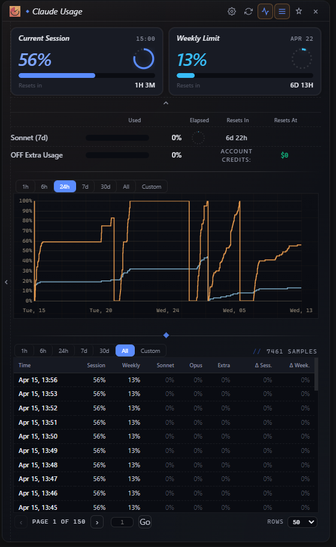
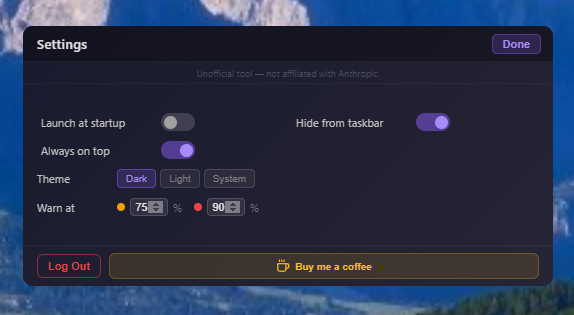

# Claude Usage Widget (GTRows fork)

Desktop widget for Claude.ai usage monitoring, now with multi-account support and Codex/OpenAI usage visibility.

This fork is based on the original [claude-usage-widget](https://github.com/SlavomirDurej/claude-usage-widget) by Slavomir Durej and adds a GTRows-focused desktop workflow, Turkish/English UI, CLI tools, history, tray controls, and provider-aware account handling.

Runs on Windows, macOS, and Linux.



---

## Features

- Real-time usage tracking for Claude session and weekly limits.
- Codex/OpenAI organization usage and cost snapshot support via the official OpenAI Usage and Costs APIs.
- Multiple saved accounts with an active-account selector.
- Secure local credential storage using Electron `safeStorage` when available.
- Visual progress bars, countdown timers, usage alerts, and configurable thresholds.
- Usage history graph and history table with export support.
- Compact mode, tray icon rendering options, always-on-top mode, and keyboard shortcuts.
- Turkish and English UI with instant language switching.
- CLI companion for status, JSON output, shell prompt segments, history export, doctor checks, and login.
- Codex-ready project automation files under `.codex/` plus `AGENTS.md` guidance.

---

## What's New in v1.16.4-gtrows.2

### Codex local quota display

- Codex can now read local rate-limit data from the active Codex session logs.
- Settings include a Codex quota display selector: used percentage (`0` to `100`) or remaining percentage (`100` to `0`).
- CLI output supports the same mode with `--quota-display used|remaining` or `CODEX_QUOTA_DISPLAY`.

### Correct exhausted-state handling

- Recent Codex premium exhaustion now marks the 5-hour quota as fully used while leaving weekly usage based on Codex's weekly limit data.
- Weekly Codex quota now reports used and remaining values consistently across the widget, history chart, and CLI JSON.

### Existing provider support

- Multi-account Claude and Codex support remains available from the settings drawer.
- Codex accounts can still use OpenAI admin/API keys for organization usage and cost snapshots.

For full release history, see [CHANGELOG.md](./CHANGELOG.md) and the [Releases](../../releases) page.

---

## Screenshots

### Main Widget


### Settings Panel



---

## Installation

### Download Pre-built Release

Windows:

1. Download the latest `Claude-Usage-Widget-{version}-win-Setup.exe` installer or `Claude-Usage-Widget-{version}-win-portable.exe` from [Releases](../../releases).
2. Run the installer or portable executable.
3. Launch "Claude Usage Widget" from the Start Menu or directly from the portable executable.

macOS:

1. Download the latest `Claude-Usage-Widget-{version}-macOS-arm64.dmg` for Apple Silicon or `Claude-Usage-Widget-{version}-macOS-x64.dmg` for Intel from [Releases](../../releases).
2. Open the DMG and drag the app to Applications.
3. Launch "Claude Usage Widget" from Applications.

If macOS Gatekeeper reports that the app is damaged or cannot be opened, run:

```bash
xattr -cr /Applications/Claude\ Usage\ Widget.app
```

Linux:

1. Download the latest AppImage, DEB, RPM, Pacman package, or tar.gz archive from [Releases](../../releases).
2. For AppImage, make it executable:

```bash
chmod +x Claude-Usage-Widget-*.AppImage
```

3. Run it:

```bash
./Claude-Usage-Widget-*.AppImage
```

On Ubuntu 22.04+, AppImage may require:

```bash
sudo apt install libfuse2
```

---

## Build from Source

Prerequisites:

- Node.js 18+
- npm 9+

```bash
git clone https://github.com/GTRows/claude-usage-widget.git
cd claude-usage-widget
npm install
npm start
```

Development commands:

```bash
npm run dev
npm test
npm run build
npm run cli
```

---

## Usage

### First Launch

1. Launch the widget.
2. Pick a provider on the login screen.
3. For Claude, sign in through the browser flow or paste a `sessionKey`.
4. For Codex/OpenAI, paste an OpenAI admin/API key with access to organization usage endpoints.
5. Name the account and connect.
6. Usage data starts displaying for the active account.

### Multiple Accounts

- Add separate Claude and Codex accounts from the login screen.
- Use Settings -> Accounts -> Active account to switch which account is polled.
- Logging out removes the selected account and switches to the next saved account when available.

### CLI

Claude login:

```bash
claude-usage login --provider claude --key sk-ant-sid01-... --org <organization-id>
```

Codex/OpenAI login:

```bash
claude-usage login --provider codex --key <openai-admin-key>
```

Environment variables:

```bash
CLAUDE_SESSION_KEY=...
CLAUDE_ORGANIZATION_ID=...
OPENAI_ADMIN_KEY=...
OPENAI_API_KEY=...
OPENAI_ORGANIZATION_ID=...
OPENAI_PROJECT_ID=...
```

Useful commands:

```bash
claude-usage status
claude-usage json
claude-usage prompt --segments 5h,7d,extra --cache 60
claude-usage history --since 7 --format csv
claude-usage doctor
```

### Keyboard Shortcuts

| Shortcut | Action |
| --- | --- |
| `Ctrl/Cmd + R` | Refresh usage |
| `Ctrl/Cmd + G` | Toggle usage graph |
| `Ctrl/Cmd + H` | Toggle history table |
| `Ctrl/Cmd + M` | Toggle compact mode |
| `Ctrl/Cmd + P` | Pin on top |
| `Ctrl/Cmd + ,` | Open or close settings |
| `Ctrl/Cmd + Q` | Quit the widget |

---

## Privacy and Security

- Credentials are stored locally only.
- Electron `safeStorage` is used for encrypted credential storage when available.
- The app does not send telemetry.
- Claude accounts communicate with Claude.ai endpoints.
- Codex/OpenAI accounts communicate with official OpenAI organization usage and costs endpoints.
- Logout clears the selected account and Claude browser cookies/session storage when applicable.

---

## Troubleshooting

Login Required keeps appearing:

- The active account credential may have expired or been removed.
- Reconnect the account from the login screen.

Codex usage shows zero percentages:

- OpenAI organization usage endpoints return token/request/cost aggregates, not Claude-style quota percentages. The widget stores the cost and aggregate metrics under the account credits/extra usage surface.

Widget not updating:

- Check internet access.
- Click refresh.
- Switch active accounts in Settings.
- Reconnect the account.

Build errors:

```bash
rm -rf node_modules
npm install
```

If issues persist, open a [Support discussion](../../discussions/categories/support) with your OS, Node.js version, and full error output.

---

## Roadmap

- [x] macOS support
- [x] Linux support
- [x] Settings panel
- [x] Remember window position
- [x] Custom warning thresholds
- [x] Configurable date and time formats
- [x] Update notifications
- [x] Usage alerts at thresholds
- [x] Compact mode
- [x] Usage history graph and table
- [x] Currency support
- [x] CLI companion
- [x] Export history with date-range filter
- [x] Keyboard shortcuts
- [x] Multiple account support
- [x] Codex/OpenAI usage support
- [x] Codex-ready `.codex/` automation files
- [ ] Fresh GTRows visual assets
- [ ] Verified macOS build with GTRows notarization
- [ ] Provider-specific UI polish for Codex token/request metrics
- [ ] Desktop notifications when the peak-throttle window starts or ends

---

Built with Electron. See [Releases](../../releases), [Changelog](./CHANGELOG.md), and [Discussions](../../discussions).
